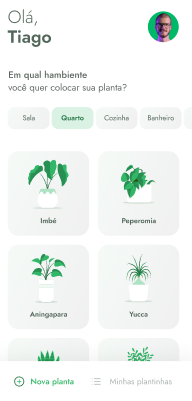
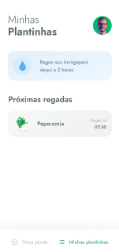
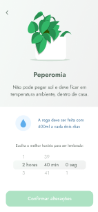
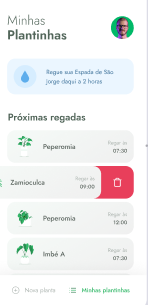
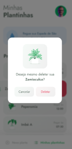

<h1> Plant Manager</h1>
<p> Plant Manager é um aplicativo que te estimula a cuidar das plantas de sua casa.</p>
<h2>Detalhes do aplicativo:</h2>
<figure>


</figure>


<p> Essa é a primeira tela que o usuário acessa. Ao selecionar o botão próximo, a seguinte tela é exibida:</p>

<p> Nesta tela é necessário colocar o nome. O app não permite passar para a outra tela se o nome não for inserido.

<p>Ainda na mesma tela, quando o usuário põe o nome, é possível ver um emoji mudando sua face e na programação a barrinha embaixo do nome fica verde, indicando que
há um nome ali. Logo após a inserção dos dados, o app g carrega a seguinte tela:</p>

<p>Após o usuário apertar o botão de confirmar, o app guarda no celular do usuário o seu nome e puxa de uma API as informações que ele precisa
para exibir as plantas.Então é carregada a seguinte tela:</p>

<p> Nesta tela os dados da API que contém o local adequado para colocar as plantas e seus nomes são inseridos nas opções horizontais e verticais respectivamente.
 Abaixo há um submenu onde é possível cadastrar uma nova planta ou ver as plantas cadastradas.</p>
 <p>Ao pressionar a opção 'nova planta' o usuário  seleciona a planta no menu e após isso aparece a seguinte tela: </p>
 
  <p>Após apertar o botão de 'Muito obrigado :D' outra tela aparece: </p>
   
<p> Nessa tela, acessível no menu 'Minhas plantinhas' aparecerá a planta que foi cadastrada.Ao selecionar a planta desejada, o usuário vai para a tela 
com a informação da planta escolhida:</p>
  
  <p> Nessa tela o usuário pode selecionar o horário em que ele deseja ser lembrado de molhar sua plantinha</p>
    
    <p>Com  a planta cadastrada, o usuário receberá notificações de quando molhar suas plantas. Porém se ele quiser deletar as informações basta
  deslizar o dedo e apertar no ícone de lixeira e o dado da planta será apagado</p>
    
  
<h6>UX do Aplicativo criada por Tiago Luchtenberg. Instagram: @tiagoluchtenberg</h6>
<h6>Criado durante o evento da NLW:Trilha React Native</h6>

<h1>Instruções de instalação (Windows)</h1>
<p> Se você não possui o ambiente configurado para codificar aplicações usando react native e expo, siga as instruções abaixo</p>
<h2> Desativando restrições</h2>
<p>  Execute o Windows Power Shell com os privilégios de administrador e execute o comando</p>

```bash
Get-ExecutionPolicy
```
<p>Se a opção retornar Restricted, execute o comando:</p>

```bash
Set-ExecutionPolicy RemoteSigned
```

<p>Ao perguntar se deseja aplicar a alteração, aperte a tecla [A](all) sim para todos</p>
<h2>Instalando o gerenciador de pacotes Chocolatey</h2>
<p> Após a permissão ser alterada é possível instalar o Chocolatey.Execute o comando:</p>

```bash
Set-ExecutionPolicy Bypass -Scope Process -Force; [System.Net.ServicePointManager]::SecurityProtocol = [System.Net.ServicePointManager]::SecurityProtocol -bor 3072; iex ((New-Object System.Net.WebClient).DownloadString('https://chocolatey.org/install.ps1'))
```

<p> Após o fim da instalação, verifique se o chocolatey foi instalado</p>

```bash
choco -v
```

<h2> Instalação do Node</h2>
<p> Agora ainda no windows power shell, vamos instalar a versão LTS mais recente do Node</p>

```bash
cinst nodejs-lts
```

<p> Novamente escolha a opção All (tecla [A]) para instalar tudo de uma vez</p>
<p>Após o fim da instalação, feche e abra o power shell como administrador e execute os seguintes comandos:</p>

```bash
node -v
npm -v
```

<p>Se o power shell retornar as versões do Node e do NPM, a instalação foi bem sucedida</p>

<h2>Instalando o yarn</h2>
<p> O yarn é opcional, porém caso opte por instalar o yarn, ele pode oferecer algumas vantagens, como por exemplo, uma velocidade maior de download e instalação de 
 pacotes comparada ao npm. Para baixá-lo execute o comando: </p>
 
 ```bash
 npm install --global yarn
 ```

<h2> Instalando o expo</h2>
<p> Para instalar o expo com o yarn, execute: </p>

```bash
yarn global add expo-cli
```

<p> Caso não queira baixar o yarn, tem essa opção aqui também:</p>

```bash
npm install expo-cli --global
```
<p> Verifique se o expo foi instalado através do comando:</p>

```bash
expo --version
```

<p> Agora o ambiente está pronto para rodar a aplicação. Após clonar a aplicação no github, pressione a tecla windows + r e digite cmd. Vá até 
 a pasta onde você salvou o arquivo plantmanager com o comando:</p>
 
 ```bash
 cd ./enderecoAteOArquivo/plantmanager
```

<p> Após chegar na pasta plantmanager, execute o comando: </p>

```bash
expo start
```

<h2>Executando a fake API Json Server</h2>
<p> Instale através do cmd a instalação do Json Server no projeto, documentação no link: https://www.npmjs.com/package/json-server </p>
</p> Após instalar o Json Server, verifique i IP da máquina indo na tecla windows + r / digite cmd/ e execute o comando</p>

```bash
ipconfig
```

<p> Após essa etapa, capture o seu ip e coloque no arquivo api.ts disponível em services e configure a porta para 3333.</p>
<p>Depois disso, no cmd e no diretório com o projeto plantmanager, execute o comando:
 
 ```bash
 json-server ./src/services/server.json --host 192.168.1.2 --port 3333 --delay 700
 ```
 
 <p>Com isso, abra o navegador, digite o seu endereço de ip no seguinte formato:</p>
 
 ```http
 http://seuip:3333/plants
 ```
 <p>Pronto! Agora é possível testar o aplicativo com a API fake 😁</p>
 <p> Para rodar em um dispositivo físico o app não se esqueça de instalar o expo go(android) ou expo(ios) para testar o app.</p>
 


