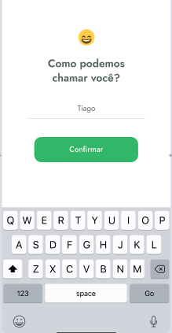
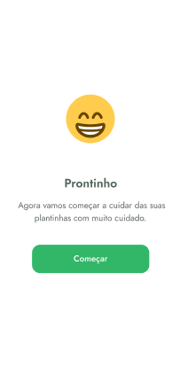
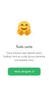

<h1> Plant Manager</h1>

 Plant Manager é um aplicativo que te estimula a cuidar das plantas de sua casa.

<h2>Detalhes do aplicativo:</h2>
<figure>

</figure>

 Essa é a primeira tela que o usuário acessa. Ao selecionar o botão próximo, a seguinte tela é exibida:

 Nesta tela é necessário colocar o nome. O app não permite passar para a outra tela se o nome não for inserido.

Ainda na mesma tela, quando o usuário põe o nome, é possível ver um emoji mudando sua face e na programação a barrinha embaixo do nome fica verde, indicando que
há um nome ali. Logo após a inserção dos dados, o app g carrega a seguinte tela:

Após o usuário apertar o botão de confirmar, o app guarda no celular do usuário o seu nome e puxa de uma API as informações que ele precisa
para exibir as plantas.Então é carregada a seguinte tela:

 Nesta tela os dados da API que contém o local adequado para colocar as plantas e seus nomes são inseridos nas opções horizontais e verticais respectivamente.
 Abaixo há um submenu onde é possível cadastrar uma nova planta ou ver as plantas cadastradas.

 
Ao pressionar a opção 'nova planta' o usuário  seleciona a planta no menu e após isso aparece a seguinte tela: 

 
  
Após apertar o botão de 'Muito obrigado :D' outra tela aparece: 

   

 Nessa tela, acessível no menu 'Minhas plantinhas' aparecerá a planta que foi cadastrada.Ao selecionar a planta desejada, o usuário vai para a tela 
com a informação da planta escolhida:

  
  
 Nessa tela o usuário pode selecionar o horário em que ele deseja ser lembrado de molhar sua plantinha

    
    
Com  a planta cadastrada, o usuário receberá notificações de quando molhar suas plantas. Porém se ele quiser deletar as informações basta
  deslizar o dedo e apertar no ícone de lixeira e o dado da planta será apagado

    
  
<h6>UX do Aplicativo criada por Tiago Luchtenberg. Instagram: @tiagoluchtenberg</h6>
<h6>Criado durante o evento da NLW:Trilha React Native</h6>
